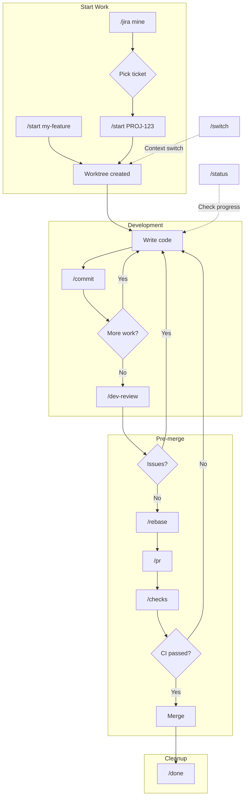

# Claude Code Config

Personal configuration for [Claude Code](https://docs.anthropic.com/en/docs/claude-code) -- custom slash commands, agents, hooks, and marketplace plugins.

## Contents

- [Prerequisites](#prerequisites)
- [Installation](#installation)
- [Marketplace Plugins](#marketplace-plugins)
- [What's Included](#whats-included)
- [Typical Workflow](#typical-workflow)
- [Permissions](#permissions)
- [Customization](#customization)

## Prerequisites

**Required:**

- [Claude Code](https://docs.anthropic.com/en/docs/claude-code) CLI installed
- Python 3 (for hooks)
- [prettier](https://prettier.io/) -- used by the `format_files.py` hook to auto-format `.md`, `.json`, and `.yaml` files after edits

```bash
brew install prettier
```

**Optional (language-specific):**

- [Node.js](https://nodejs.org/) -- needed if you add MCP servers that run via `npx`
- [GitHub CLI (`gh`)](https://cli.github.com/) -- required for `/pr` command and `gh` permissions in `settings.json`
- [uv](https://docs.astral.sh/uv/) -- Python package manager (replaces pip/poetry)
- [ruff](https://docs.astral.sh/ruff/) -- Python linter/formatter
- [Rust toolchain](https://rustup.rs/) -- for `cargo fmt`, `cargo clippy`, `cargo test`, `cargo build`

These are pre-approved in `settings.json` permissions. Remove any you don't use, or leave them -- unused permissions are harmless.

## Installation

If you already have a `~/.claude` directory, back it up first:

```bash
mv ~/.claude ~/.claude.bak
```

Clone the repo and symlink it to `~/.claude`:

```bash
git clone https://github.com/taloncjones/claude-config.git
ln -sf "$(pwd)/claude-config" ~/.claude
```

Make hooks executable (should already be, but just in case):

```bash
chmod +x ~/.claude/hooks/*.py
```

Verify the symlink:

```bash
ls -la ~/.claude
# Should point to your cloned repo
```

## Marketplace Plugins

Plugins are enabled in `settings.json`. You need to install each one via the Claude Code CLI:

```bash
claude plugin add code-review --source claude-plugins-official
claude plugin add commit-commands --source claude-code-plugins
claude plugin add feature-dev --source claude-code-plugins
claude plugin add python-development --source claude-code-workflows
claude plugin add cicd-automation --source claude-code-workflows
claude plugin add code-documentation --source claude-code-workflows
claude plugin add code-refactoring --source claude-code-workflows
claude plugin add context7 --source claude-plugins-official
claude plugin add atlassian --source claude-plugins-official
claude plugin add frontend-design --source claude-plugins-official
```

Or install interactively by running `claude` and using `/plugins` to browse the marketplace.

| Plugin               | Source                    | Description                               |
| -------------------- | ------------------------- | ----------------------------------------- |
| `code-review`        | `claude-plugins-official` | PR code review                            |
| `commit-commands`    | `claude-code-plugins`     | Commit, push, and PR shortcuts            |
| `feature-dev`        | `claude-code-plugins`     | Guided feature development                |
| `python-development` | `claude-code-workflows`   | Python testing, packaging, async patterns |
| `cicd-automation`    | `claude-code-workflows`   | CI/CD, Terraform, K8s, GitHub Actions     |
| `code-documentation` | `claude-code-workflows`   | Documentation generation and review       |
| `code-refactoring`   | `claude-code-workflows`   | Legacy modernization and code review      |
| `context7`           | `claude-plugins-official` | Up-to-date library documentation lookup   |
| `atlassian`          | `claude-plugins-official` | Jira and Confluence integration           |
| `frontend-design`    | `claude-plugins-official` | Frontend UI design and components         |

Skip any plugins you don't need -- just remove the corresponding line from `enabledPlugins` in `settings.json`.

## What's Included

### Slash Commands (`commands/`)

| Command        | Description                                  |
| -------------- | -------------------------------------------- |
| `/arch-review` | Architecture review (SOLID, design patterns) |
| `/arewedone`   | Structural completeness check                |
| `/bugs`        | Systematic bug hunting and code audit        |
| `/checks`      | View CI/PR check status                      |
| `/commit`      | Create commit with auto-detected scope       |
| `/debug`       | Root cause debugging                         |
| `/dev-review`  | Pre-PR review (arch, bugs, compliance)       |
| `/doc`         | Generate or review documentation             |
| `/done`        | Finish work and clean up worktree            |
| `/explain`     | Deep dive code explanation                   |
| `/jira`        | Interact with linked Jira ticket             |
| `/lint`        | Run linters and formatters                   |
| `/perf-check`  | Performance analysis                         |
| `/pr`          | Create a pull request                        |
| `/rebase`      | Smart git rebase                             |
| `/refresh`     | Regenerate CLAUDE.md                         |
| `/start`       | Start new work (Jira + worktree)             |
| `/status`      | Check current work status                    |
| `/switch`      | Switch between worktrees                     |
| `/test`        | Run project tests                            |
| `/worktree`    | Git worktree management                      |

### Agents (`agents/`)

Specialized sub-agents that Claude Code dispatches for complex tasks:

| Agent                   | Description                                         |
| ----------------------- | --------------------------------------------------- |
| `architecture-reviewer` | Review architectural decisions and scalability      |
| `bug-finder`            | Audit for logic errors, race conditions, edge cases |
| `completeness-reviewer` | Verify structural integrity after changes           |
| `debugger`              | Structured debugging (reproduce, hypothesize, fix)  |
| `doc-implementer`       | Write/update docstrings and documentation           |
| `doc-reviewer`          | Audit documentation quality and gaps                |
| `performance-profiler`  | Find bottlenecks, memory leaks, slow paths          |

### Hooks (`hooks/`)

Automated guardrails that run before and after tool calls:

| Hook                   | Trigger                | Description                                    |
| ---------------------- | ---------------------- | ---------------------------------------------- |
| `block_secrets.py`     | Pre: Read, Edit, Write | Prevents reading/writing sensitive files       |
| `commit_guard.py`      | Pre: Bash              | Blocks AI attribution in commits               |
| `protect_claude_md.py` | Pre: Edit, Write       | Warns before editing global CLAUDE.md          |
| `emoji_guard.py`       | Post: Edit, Write      | Prevents emojis in file content                |
| `no_ai_comments.py`    | Post: Edit, Write      | Blocks "Generated by AI" style comments        |
| `format_files.py`      | Post: Edit, Write      | Auto-formats with prettier (.md, .json, .yaml) |

**Note:** `block_secrets.py` matches filenames containing "secrets", which includes its own filename. This prevents Claude from reading the hook file via the Read tool, but the hook itself executes normally -- Claude Code runs hooks as subprocesses, not through the Read tool. If you need Claude to edit this hook, rename it temporarily or edit it manually.

### Global Instructions (`CLAUDE.md`)

Rules and preferences applied to every Claude Code session:

- Concise responses, no emojis, no AI attribution
- Commit format: `<scope>: <summary>` (imperative mood)
- Python: `uv` + ruff, Rust: `cargo fmt` + clippy
- No secrets in code

## Typical Workflow

This config supports a worktree-based workflow with optional Jira integration. Each task gets its own worktree, keeping work isolated and easy to switch between.



### Starting work

```
/start my-feature             # Start with topic name (no Jira)
/start PROJ-123               # Start from Jira ticket (if plugin available)
/jira mine                    # List your Jira tickets first
```

`/start` creates a worktree and branch. With Jira: `user/PROJ-123/topic-slug`. Without: `user/topic-slug`.

### During development

```
/status                       # Overview: branch, Jira (if linked), PR status
/commit                       # Commit with auto-detected scope
/commit add user validation   # Commit with custom summary
```

### Switching context

```
/switch                       # List worktrees and pick one
/switch PROJ-124              # Switch by Jira ticket
/switch my-feature            # Switch by topic name
```

### Pre-merge

```
/dev-review                   # Run architecture, bug, and compliance checks
/rebase                       # Sync with main
/pr                           # Create PR (includes Jira link if available)
/checks                       # View CI status
```

### After merge

```
/done                         # Clean up: remove worktree, delete branch, transition Jira
```

### Jira operations (requires Atlassian plugin)

```
/jira                         # Show current ticket details
/jira mine                    # List tickets assigned to you
/jira comment "WIP: tests passing"
/jira progress                # Transition to In Progress
/jira done                    # Transition to Done (without cleanup)
```

## Permissions

The config pre-approves safe read-only commands (`ls`, `git status`, `git diff`, etc.) and requires confirmation for destructive operations (`rm`, `git push`, `git commit`, `git rebase`).

See `settings.json` for the full allow/ask lists.

## Customization

**`CLAUDE.md`** -- Your global prompt. Adjust response style, code standards, and commit conventions.

**`settings.json`** -- Permissions, MCP servers, hooks, and plugins. Add or remove entries to fit your workflow.

**`hooks/`** -- Add or remove Python scripts. Register them in the `hooks` section of `settings.json`. Each hook receives tool call data on stdin as JSON and exits 0 (allow) or 2 (block).

**`commands/`** -- Add `.md` files to create new slash commands. The filename becomes the command name (e.g., `foo.md` creates `/foo`).

**`agents/`** -- Add `.md` files to define new sub-agents. Claude Code dispatches to these for complex tasks.

## License

MIT
